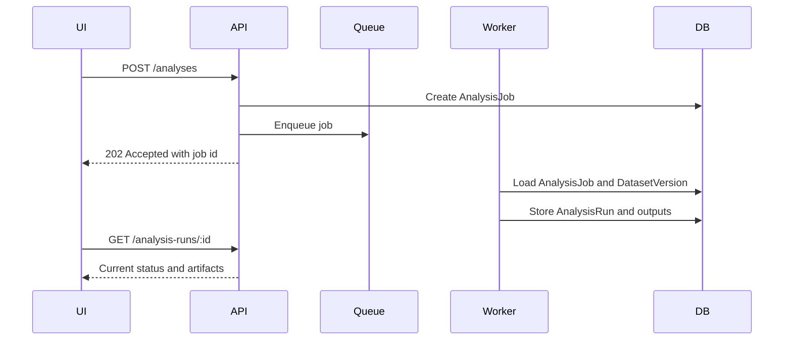

# API Design

## Purpose
This document defines API conventions for the NestJS backend. It is a contract design guide, not a full OpenAPI specification.

## API Style
Recommended style:
- REST-first JSON API
- versioned under `/api/v1`
- explicit tenant-scoped routes
- async job resources for long-running operations

Why:
- clear fit for NestJS
- straightforward permission and audit boundaries
- easier client implementation than GraphQL for this workflow-heavy system

## Tenant-Aware Route Shape
All tenant-owned resources should be nested under tenant scope:
- `/api/v1/tenants/:tenantId/projects`
- `/api/v1/tenants/:tenantId/projects/:projectId/datasets`

Rules:
- route tenant is authoritative
- project lookup must validate tenant ownership
- APIs should reject cross-tenant resource mismatches explicitly

## Resource Naming
Naming principles:
- plural nouns for collections
- singular nouns implied by resource ids
- versioned resources exposed as nested collections or explicit version endpoints

Examples:
- `projects`
- `imports`
- `cohorts`
- `datasets`
- `dataset-versions`
- `analyses`
- `analysis-runs`
- `manuscripts`
- `manuscript-versions`
- `ai-tasks`

## Response Design
Recommended patterns:
- list endpoints return `items`, `page`, `pageSize`, `total`
- detail endpoints return a resource object with related summaries where useful
- write endpoints return created resource or accepted job reference

## Pagination and Filtering
Use cursor or page-number pagination consistently. MVP can start with page-number pagination if data volumes are moderate.

Common query parameters:
- `page`
- `pageSize`
- `sort`
- `status`
- `createdBy`
- `createdAfter`
- `createdBefore`

Filtering should always remain tenant-scoped.

## Idempotency Policy
Require or support idempotency keys for:
- invite creation
- upload registration
- dataset materialization requests
- analysis submission
- AI draft requests
- manuscript export requests

Recommended header:
- `Idempotency-Key`

## Long-Running Job Endpoints
Long-running operations should create job resources or accepted task records.

Examples:
- `POST /api/v1/tenants/:tenantId/projects/:projectId/imports`
- `POST /api/v1/tenants/:tenantId/projects/:projectId/datasets/materializations`
- `POST /api/v1/tenants/:tenantId/projects/:projectId/analyses`
- `POST /api/v1/tenants/:tenantId/projects/:projectId/ai/tasks`

Response pattern:
- `202 Accepted`
- include job or task id
- include status URL

## Error Format
Recommended error envelope:

```json
{
  "error": {
    "code": "DATASET_NOT_APPROVED",
    "message": "Dataset version must be approved before AI drafting.",
    "requestId": "req_123",
    "details": []
  }
}
```

Error classes:
- `UNAUTHENTICATED`
- `FORBIDDEN`
- `NOT_FOUND`
- `VALIDATION_ERROR`
- `CONFLICT`
- `RESOURCE_STATE_ERROR`
- `PROCESSING_ERROR`

## Audit Expectations for Write Endpoints
All write endpoints must:
- resolve actor identity
- resolve tenant and project context
- emit audit metadata
- include correlation or request id

High-sensitivity endpoints should also emit data access or approval events.

## Core Endpoint Families

### Tenants and memberships
- `GET /api/v1/tenants`
- `GET /api/v1/tenants/:tenantId`
- `POST /api/v1/tenants`
- `GET /api/v1/tenants/:tenantId/members`
- `POST /api/v1/tenants/:tenantId/invitations`

### Projects
- `GET /api/v1/tenants/:tenantId/projects`
- `POST /api/v1/tenants/:tenantId/projects`
- `GET /api/v1/tenants/:tenantId/projects/:projectId`
- `PATCH /api/v1/tenants/:tenantId/projects/:projectId`
- `GET /api/v1/tenants/:tenantId/projects/:projectId/members`
- `POST /api/v1/tenants/:tenantId/projects/:projectId/members`

### Imports and mappings
- `GET /api/v1/tenants/:tenantId/projects/:projectId/imports`
- `POST /api/v1/tenants/:tenantId/projects/:projectId/imports`
- `GET /api/v1/tenants/:tenantId/projects/:projectId/imports/:importId`
- `POST /api/v1/tenants/:tenantId/projects/:projectId/imports/:importId/mappings`
- `GET /api/v1/tenants/:tenantId/projects/:projectId/imports/:importId/validation-issues`

### Cohorts
- `GET /api/v1/tenants/:tenantId/projects/:projectId/cohorts`
- `POST /api/v1/tenants/:tenantId/projects/:projectId/cohorts`
- `GET /api/v1/tenants/:tenantId/projects/:projectId/cohorts/:cohortId`
- `POST /api/v1/tenants/:tenantId/projects/:projectId/cohorts/:cohortId/snapshots`

### Datasets
- `GET /api/v1/tenants/:tenantId/projects/:projectId/datasets`
- `POST /api/v1/tenants/:tenantId/projects/:projectId/datasets/materializations`
- `GET /api/v1/tenants/:tenantId/projects/:projectId/datasets/:datasetId`
- `GET /api/v1/tenants/:tenantId/projects/:projectId/dataset-versions/:datasetVersionId`
- `POST /api/v1/tenants/:tenantId/projects/:projectId/dataset-versions/:datasetVersionId/approve`

### Analyses
- `GET /api/v1/tenants/:tenantId/projects/:projectId/analyses`
- `POST /api/v1/tenants/:tenantId/projects/:projectId/analyses`
- `GET /api/v1/tenants/:tenantId/projects/:projectId/analysis-runs/:analysisRunId`
- `POST /api/v1/tenants/:tenantId/projects/:projectId/analysis-runs/:analysisRunId/approve`

### Manuscripts
- `GET /api/v1/tenants/:tenantId/projects/:projectId/manuscripts`
- `POST /api/v1/tenants/:tenantId/projects/:projectId/manuscripts`
- `GET /api/v1/tenants/:tenantId/projects/:projectId/manuscripts/:manuscriptId`
- `POST /api/v1/tenants/:tenantId/projects/:projectId/manuscripts/:manuscriptId/versions`
- `POST /api/v1/tenants/:tenantId/projects/:projectId/manuscript-versions/:manuscriptVersionId/approve-export`

### AI tasks
- `POST /api/v1/tenants/:tenantId/projects/:projectId/ai/tasks`
- `GET /api/v1/tenants/:tenantId/projects/:projectId/ai/tasks/:aiTaskId`
- `POST /api/v1/tenants/:tenantId/projects/:projectId/ai/tasks/:aiTaskId/review`

## Command vs Query Guidance
Write endpoints should be command-oriented and explicit:
- approve
- snapshot
- materialize
- export

Read endpoints should return current state and history views.

## Contract-Level Invariants
- dataset approval must precede AI drafting
- analysis outputs used by AI must be approved
- manuscript export requires approved manuscript version
- all route resource ids must belong to the specified tenant and project

## Example Async Flow


## Database Implications
- APIs should expose immutable version resources directly
- approval endpoints map cleanly to approval tables and audit events
- resource lookup should prefer composite scoping by tenant and project before id

## Assumptions
- OpenAPI generation will be added later from DTO and controller metadata
- API consumers are primarily the first-party Next.js app in MVP
