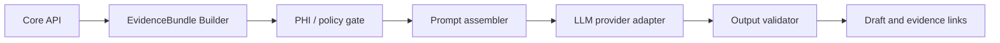
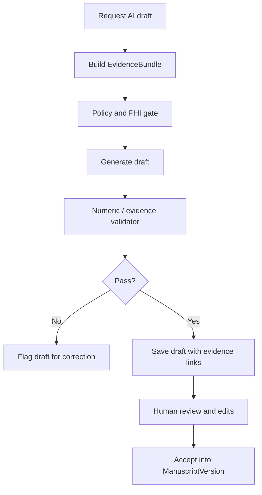

# AI Guardrails and Grounding

## Purpose
This document defines how AI is allowed to participate in the research workflow without inventing statistics, unsupported claims, or unsafe data disclosures.

## AI Role in the Product
AI is an assistant for research drafting and interpretation support within tightly controlled boundaries. It is not an autonomous analyst, not a source of truth, and not a direct clinical decision engine.

Allowed MVP tasks:
- manuscript outline support
- Methods draft generation
- Results draft generation from approved outputs
- Discussion draft assistance from approved summaries
- table and figure narrative assistance
- revision assistance inside a reviewable editor

Not allowed in MVP:
- unrestricted free-form data exploration
- direct access to raw uploads
- unsupported external citations
- invented statistical interpretation not grounded in outputs
- fully automated final manuscript export

## AI Orchestration Boundary
The core API should not talk directly to model providers. It should call a dedicated orchestration layer that:
- assembles evidence
- applies PHI policy
- chooses provider
- performs prompt construction
- validates output
- records provenance and audit events

## Provider Abstraction Model
Provider integration should use a narrow internal contract:
- input: task type, evidence bundle, policy mode, template version
- output: structured draft content, usage metadata, warnings

Providers to design for:
- external hosted LLM
- future Anthropic/OpenAI style adapters
- future self-hosted/private models

The rest of the platform must depend on provider-neutral task contracts.

## PHI Modes
MVP mode:
- `PHI_MINIMIZED`

Deferred mode:
- `PHI_ALLOWED_PRIVATE`

`PHI_MINIMIZED` rules:
- only approved metadata and aggregate outputs
- no raw row-level patient data
- no direct identifiers
- no free-text clinical notes

## EvidenceBundle Contract
`EvidenceBundle` is the only allowed input class for manuscript drafting.

Bundle contents may include:
- study title and objectives
- study design metadata
- cohort metadata
- dataset version metadata
- approved descriptive outputs
- approved regression or survival outputs
- approved table and figure summaries
- approved reviewer notes or structured interpretation guidance

Bundle contents must exclude by default:
- raw source files
- raw patient-level records
- unapproved exploratory outputs
- arbitrary user-uploaded notes with PHI

## Prompt Assembly Rules
- prompts must instruct the model to use supplied evidence only
- prompts must require explicit evidence references for numeric and factual claims
- prompts must instruct the model to say evidence is insufficient rather than speculate
- template versions must be stored and referenced in audit metadata
- task type must be explicit, such as `METHODS_DRAFT` or `RESULTS_DRAFT`

## Grounding Requirements
Every AI-generated claim should be grounded through one or more evidence links.

Required grounding patterns:
- numerical claims link to approved analysis outputs
- sample size claims link to dataset or cohort metadata
- methodological claims link to study metadata and analysis spec
- figure/table references link to exact artifact ids

The UI should expose evidence references for reviewer inspection.

## Numeric Claim Validation
Post-generation validation should detect:
- numbers not present in source evidence
- altered percentages without supported derivation
- mismatched p-values, hazard ratios, confidence intervals
- unsupported subgroup statements

Validator actions:
- block draft when severe mismatch exists
- downgrade to warning for style issues
- attach structured validation report to the AI draft record

## Unsupported Claim Handling
When the model emits unsupported content:
- mark draft `VALIDATION_FAILED` or `READY_FOR_REVIEW_WITH_WARNINGS` depending on severity
- surface exact unsupported spans where feasible
- require user revision or regenerate with narrower scope
- prevent unsupported text from becoming export-approved automatically

## Review and Approval Workflow

Rules:
- AI output is always draft text
- accepted text still remains attributable to an AI task and reviewer
- final export requires manuscript approval, not just AI draft acceptance

## Audit Requirements
Each AI task should capture:
- actor
- tenant and project
- manuscript and section context
- task type
- evidence bundle id and version
- provider and model id
- template version
- token usage or provider metadata where available
- validation outcomes
- review decision

## Redaction and Minimization
Where fields may contain PHI or quasi-identifiers:
- default to exclusion from EvidenceBundle
- include only if policy explicitly permits and provider mode supports it
- prefer aggregate summaries over raw excerpts

## Deferred Private Model Path
Future private deployment mode may allow:
- self-hosted models
- private VPC execution
- expanded evidence detail
- organization-specific policy toggles

Even then:
- evidence bundles remain required
- audit and validation remain mandatory
- model access to unrestricted raw tables should still be avoided

## Non-Negotiable Guardrails
- no AI output without an EvidenceBundle
- no free-form raw data access
- no invented citations
- no invented statistics
- no final manuscript export without human approval
- no silent acceptance of validation failures

## Database Implications
- AI tasks, evidence bundles, evidence links, and validation reports need first-class tables
- prompt templates and provider metadata should be versioned
- AI output should store draft text by section with provenance links, not as opaque blobs only

## Assumptions
- MVP uses external hosted models only in PHI-minimized mode
- Results drafting is based on approved analysis artifacts, not raw numerical tables directly
