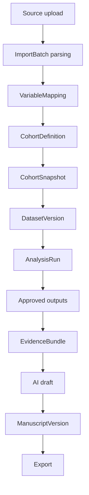

# Data Lifecycle and Lineage

## Purpose
This document defines the governed research data lifecycle from source intake to manuscript export. It is the reproducibility backbone for the platform.

## Lifecycle Overview
The platform treats research data as a chain of immutable and reviewable artifacts:

1. source intake
2. variable mapping
3. cohort definition
4. cohort snapshot
5. dataset materialization
6. analysis execution
7. analysis output approval
8. evidence bundling
9. AI drafting
10. manuscript approval and export

## Source Ingestion
MVP source types:
- CSV upload
- Excel upload

Source registration requirements:
- tenant and project ownership
- uploader identity
- original filename
- content checksum
- content type
- uploaded timestamp
- parse status

Processing steps:
1. register file metadata
2. scan file
3. parse sheets/tabs and headers
4. profile columns
5. detect validation issues
6. stage import results

Rules:
- original source files are immutable once registered
- reparsing creates a new import attempt or batch state, not mutation of historical facts
- all parse failures remain auditable

## Variable Mapping
Purpose:
- convert source columns into canonical research variables usable by cohorting and analysis

Mapping requirements:
- source column name
- canonical variable id
- inferred and approved type
- units if applicable
- coding dictionary if categorical
- missing value rules
- transformation notes if allowed

Rules:
- mappings are versioned with the import batch
- manual overrides are attributable to a user
- unresolved mapping issues block downstream dataset materialization
- mapping changes after cohorting should trigger new downstream versions, not mutation

## Cohort Definition
Supported criteria direction:
- age
- sex/gender
- diagnosis codes
- laboratory thresholds
- medications
- date windows
- inclusion and exclusion rules

Model:
- cohort definition contains nested rule groups and criteria
- evaluation target is a specific approved source import or source data version

Important semantics:
- cohort definition is mutable during design
- cohort snapshot is immutable
- previews are advisory; snapshots are the reproducible boundary

## Cohort Snapshot
A `CohortSnapshot` captures:
- source version reference
- criteria version
- execution timestamp
- row count
- membership manifest or deterministic reference
- execution warnings

Rules:
- downstream datasets reference snapshots, not mutable cohort definitions
- resnapshoting the same definition after source changes creates a new snapshot

## Dataset Versioning
`DatasetVersion` is the core reproducible analysis artifact.

Each dataset version should record:
- dataset logical id
- version number or semantic sequence
- tenant and project
- source lineage references
- cohort snapshot reference
- included variables
- row count
- column definitions
- schema hash
- content checksum
- materialized storage location
- created timestamp and actor
- approval state

Rules:
- immutable after creation
- no in-place row edits
- fixes require a new dataset version
- approval is separate from creation

## Lineage Model
Lineage must be explicit and queryable.

Minimum lineage edges:
- `ImportBatch -> VariableMapping`
- `ImportBatch -> CohortSnapshot`
- `CohortSnapshot -> DatasetVersion`
- `DatasetVersion -> AnalysisRun`
- `AnalysisRun -> AnalysisOutput`
- `Approved AnalysisOutput -> EvidenceBundle`
- `EvidenceBundle -> AIOutputDraft`
- `AIOutputDraft and AnalysisOutput -> ManuscriptVersion`

Lineage should support answering:
- where did this table come from
- which source file and mapping version produced this dataset
- which analysis run fed this manuscript paragraph

## Analysis Input/Output Provenance
Every `AnalysisRun` must store:
- dataset version id
- analysis spec id
- parameter payload
- analytics image or environment version
- package lock or manifest version
- start and end times
- job outcome
- output manifest

Every output artifact must store:
- originating run id
- artifact type
- checksum
- storage location
- render settings if relevant
- approval state

## Immutability Rules
- source files are immutable
- cohort snapshots are immutable
- dataset versions are immutable
- analysis runs are immutable after completion
- approved outputs are immutable
- manuscript versions are immutable snapshots; editing creates a new version

Allowed mutable records:
- draft cohort definitions
- project metadata
- membership records
- review state records

## Approval Checkpoints
Required approval gates:

1. Dataset approval
- required before AI use
- may also be required before some analysis families depending on policy

2. Analysis output approval
- required before EvidenceBundle generation

3. AI draft review
- required before inclusion in approved manuscript version

4. Manuscript export approval
- required before external export

## Failure and Retry Semantics

### Import failures
- failed parse remains recorded
- retry creates a new processing attempt under the same logical upload or new batch depending on implementation
- validation failures do not silently coerce data

### Dataset materialization failures
- failure records point to source snapshot and error details
- rerun generates a new job attempt

### Analysis failures
- failed runs remain visible in history
- rerun creates a new `AnalysisRun`
- no overwriting of successful outputs

### AI validation failures
- unsupported claims or numeric mismatches move output to `VALIDATION_FAILED`
- corrected reruns create new draft versions

## Supersession Rules
- supersession always points from old artifact to newer approved artifact
- superseded artifacts remain available for audit and reproducibility
- active UI should default to latest approved artifact, not latest created artifact

## Data Quality and Validation Philosophy
- capture source truth, validation state, and reviewer actions separately
- do not mutate historical imports to “clean” them silently
- transformations must be explicit, attributable, and versioned
- derived variables should be reproducible from declared logic

## Database Implications
- use separate version tables rather than mutable row replacement
- store checksums and hashes for content and schema verification
- lineage edges may be stored as explicit relational rows rather than inferred joins
- artifact metadata belongs in PostgreSQL even when binaries live in object storage

## Assumptions
- MVP prioritizes uploaded structured data rather than live connectors
- cohorting is performed against structured, mapped variables
- approved downstream use is based on immutable versions, not mutable working tables
