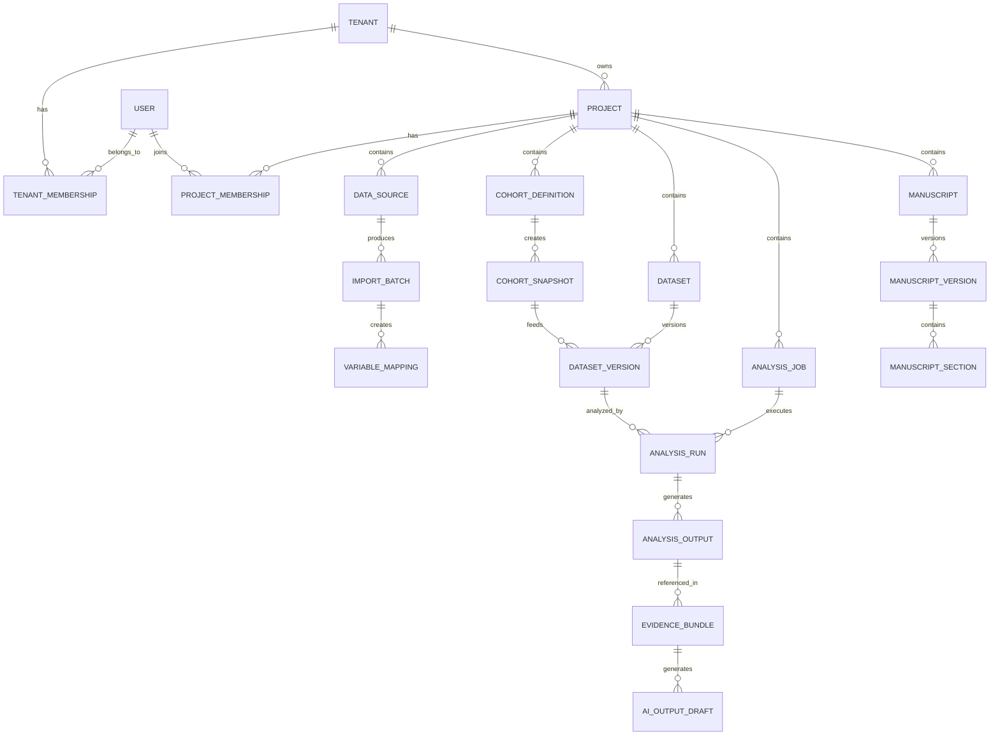

# Domain Model

## Purpose
This document defines domain modules, aggregate ownership, core entities, and state transitions for the clinical research platform. It is the primary reference for module write ownership and invariants.

## Domain Modules

### Identity and Access
Responsibilities:
- user identity
- authentication
- session context
- invitations
- membership resolution
- platform administration boundaries

Core entities:
- `User`
- `Session`
- `Invitation`
- `PlatformRoleAssignment`

### Tenants and Memberships
Responsibilities:
- tenant creation
- tenant settings
- team and organization profiles
- tenant membership and role assignment

Core entities:
- `Tenant`
- `TenantSettings`
- `TenantMembership`
- `TenantPolicy`

### Projects and Studies
Responsibilities:
- research workspace lifecycle
- study metadata
- collaborator management
- project-scoped permissions

Core entities:
- `Project`
- `Study`
- `ProjectMembership`
- `ProjectStatusHistory`

### eCRF and Variables
Responsibilities:
- form definition
- field metadata
- validation rules
- submission capture
- reusable research variable registry

Core entities:
- `FormDefinition`
- `FormVersion`
- `FormField`
- `FormSubmission`
- `ResearchVariable`

### Data Ingestion
Responsibilities:
- upload intake
- source file registration
- parsing
- profiling
- mapping
- validation issue capture

Core entities:
- `DataSource`
- `ImportBatch`
- `ImportFile`
- `ImportColumnProfile`
- `VariableMapping`
- `ValidationIssue`

### Cohorts
Responsibilities:
- inclusion/exclusion logic
- temporal criteria
- saved cohort definitions
- cohort preview and snapshot

Core entities:
- `CohortDefinition`
- `CohortRuleGroup`
- `CohortCriterion`
- `CohortSnapshot`
- `CohortMembership`

### Datasets and Lineage
Responsibilities:
- dataset materialization
- immutable version storage
- schema metadata
- provenance tracking
- approval and freeze states

Core entities:
- `Dataset`
- `DatasetVersion`
- `DatasetColumn`
- `DatasetLineageEdge`
- `DatasetApproval`

### Analyses
Responsibilities:
- analysis specification
- job orchestration
- run state
- output storage
- reproducibility metadata

Core entities:
- `AnalysisSpec`
- `AnalysisJob`
- `AnalysisRun`
- `AnalysisOutput`
- `FigureArtifact`
- `TableArtifact`

### AI Orchestration
Responsibilities:
- approved evidence assembly
- prompt preparation
- provider routing
- output validation
- draft review state

Core entities:
- `AITask`
- `EvidenceBundle`
- `AIPromptContext`
- `AIOutputDraft`
- `AIEvidenceLink`
- `AIReviewDecision`

### Manuscripts
Responsibilities:
- manuscript creation
- section lifecycle
- draft versioning
- export approval

Core entities:
- `Manuscript`
- `ManuscriptVersion`
- `ManuscriptSection`
- `ManuscriptExport`
- `ManuscriptApproval`

### Audit and Compliance
Responsibilities:
- append-only audit
- access logs
- security events
- approval logs

Core entities:
- `AuditEvent`
- `DataAccessEvent`
- `SecurityEvent`
- `ApprovalRecord`

## Aggregate Roots and Write Ownership

### Tenant aggregate
Root:
- `Tenant`

Owned writes:
- tenant settings
- tenant lifecycle
- tenant policy changes

### Project aggregate
Root:
- `Project`

Owned writes:
- study metadata
- project memberships
- project settings

### Form aggregate
Root:
- `FormDefinition`

Owned writes:
- form versions
- fields
- rules

### Ingestion aggregate
Root:
- `ImportBatch`

Owned writes:
- import files
- column profiles
- variable mappings
- validation issues

### Cohort aggregate
Root:
- `CohortDefinition`

Owned writes:
- rule groups
- criteria
- snapshots

### Dataset aggregate
Root:
- `Dataset`

Owned writes:
- dataset versions
- lineage edges
- approval state

### Analysis aggregate
Root:
- `AnalysisJob`

Owned writes:
- run lifecycle
- outputs
- artifact registration

### Manuscript aggregate
Root:
- `Manuscript`

Owned writes:
- manuscript versions
- sections
- exports
- approvals

### AI task aggregate
Root:
- `AITask`

Owned writes:
- evidence bundle references
- output drafts
- review decisions

## Core Entity Map

## Cross-Module Interaction Rules
- Identity resolves actor and active tenant, but does not enforce domain-specific resource policies itself
- Tenant membership gates project visibility, but project membership refines write and review permissions
- Ingestion produces source facts; it does not create cohort or analysis artifacts directly
- Cohorts reference approved source versions and produce snapshots
- Datasets are materialized from snapshots and source mappings, not from mutable ad hoc queries
- Analyses only run against immutable dataset versions
- AI drafting only consumes approved evidence bundles
- Manuscripts may embed AI-generated text, but export approval remains in Manuscripts and Approvals domains
- Audit receives events from all domains and must not own business workflows

## State Models

### Project lifecycle
States:
- `DRAFT`
- `ACTIVE`
- `ARCHIVED`
- `CLOSED`

Transitions:
- `DRAFT -> ACTIVE` when required metadata exists
- `ACTIVE -> ARCHIVED` for inactive but recoverable workspaces
- `ACTIVE -> CLOSED` for completed studies

### DatasetVersion lifecycle
States:
- `BUILDING`
- `READY`
- `APPROVED`
- `SUPERSEDED`
- `RETIRED`

Rules:
- `READY` means materialization succeeded
- `APPROVED` required for downstream AI use
- Versions are immutable after `READY`
- Superseding creates a new version; it never mutates the old one

### AnalysisRun lifecycle
States:
- `QUEUED`
- `RUNNING`
- `SUCCEEDED`
- `FAILED`
- `CANCELLED`
- `APPROVED`

Rules:
- `APPROVED` is a review state layered on a successful run
- failed runs remain audit-visible

### ManuscriptVersion lifecycle
States:
- `DRAFT`
- `IN_REVIEW`
- `APPROVED_FOR_EXPORT`
- `EXPORTED`
- `SUPERSEDED`

### AI draft lifecycle
States:
- `REQUESTED`
- `GENERATING`
- `VALIDATION_FAILED`
- `READY_FOR_REVIEW`
- `REJECTED`
- `ACCEPTED`

## Business Invariants
- A project belongs to one tenant and never moves tenants
- A dataset version points to immutable source lineage
- An analysis run references exactly one dataset version
- AI output cannot be finalized without source evidence links
- Manuscript export requires a reviewed manuscript version
- Organization admin does not imply project data access
- Every sensitive write emits an audit event
- Every tenant-scoped query must include `tenant_id`

## Module Ownership Boundaries
- Only Tenants module can create or mutate tenants and tenant settings
- Only Projects module can manage project lifecycle and memberships
- Only Forms module mutates form schemas and submissions
- Only Ingestion module mutates import batches, mappings, and validation issues
- Only Cohorts module mutates cohort rules and snapshots
- Only Datasets module creates dataset versions and lineage edges
- Only Analyses module creates analysis jobs and registers analysis outputs
- Only AI Orchestration module creates evidence bundles and AI drafts
- Only Manuscripts module creates manuscript versions and export records
- Audit is append-only and has no authority to alter business state

## Database Implications
- Aggregates map well to table families with strict foreign keys
- Status histories should be explicit for regulatory traceability
- Append-only version tables are preferred over mutable record replacement
- Polymorphic references should be used sparingly and only where read models benefit materially

## Assumptions
- `Project` is the primary working aggregate in MVP
- Study and project may remain closely coupled in v1
- AI tasks are subordinate to project and manuscript contexts rather than free-floating assistant sessions
