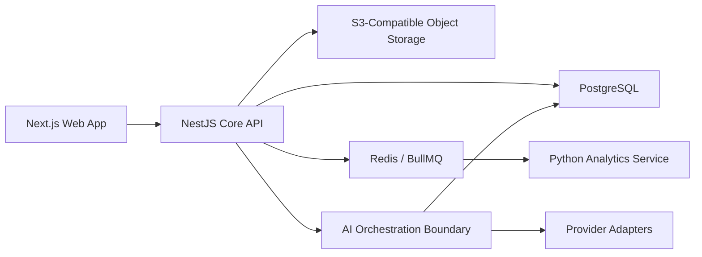
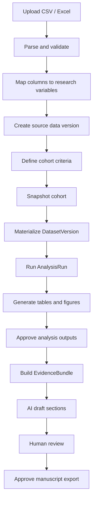
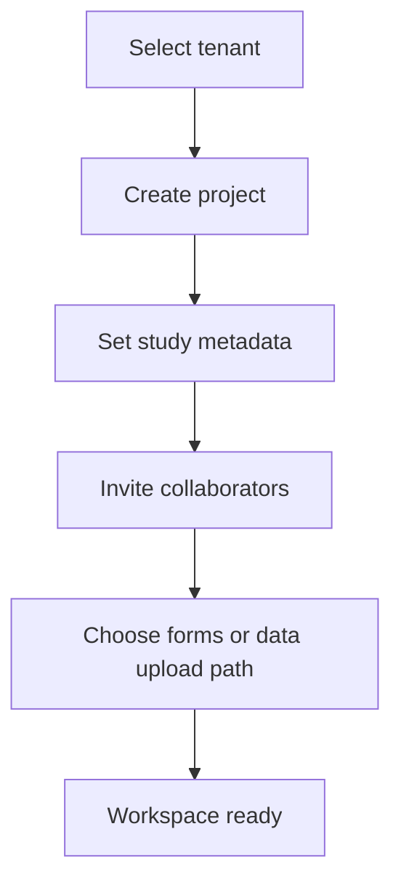
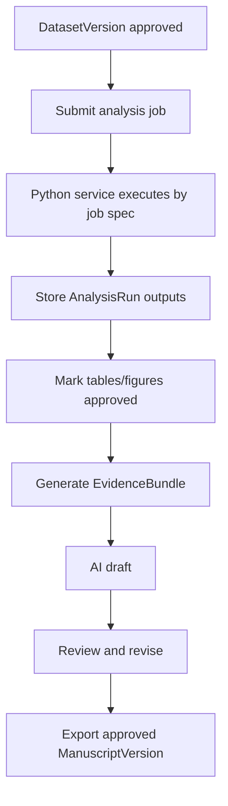

# Technical Blueprint

## Purpose
This platform is an AI-native clinical research workspace for turning governed clinical data into reproducible analyses and publishable evidence. It is not a direct patient care system and not a generic REDCap clone. The core product promise is governed data intake, cohort definition, reproducible analytics, publication artifact generation, and grounded AI-assisted manuscript drafting.

## Goals
- Support `PERSONAL`, `TEAM`, and `ORGANIZATION` research tenants
- Allow a single doctor to belong to multiple tenants concurrently
- Enforce strict tenant isolation and project-scoped permissions
- Provide reproducible dataset and analysis lineage
- Generate journal-ready tables and figures
- Use AI only from approved evidence bundles with human review before export

## Non-Goals for MVP
- Real-time EHR writeback
- Direct treatment recommendations
- Arbitrary code notebooks
- Broad literature review and external citation generation
- Full enterprise SSO/SCIM on day one
- Multi-site federated data mesh

## Architectural Principles
- Modular monolith first
- Strong tenant isolation at application and database layers
- PostgreSQL Row Level Security where it materially reduces leakage risk
- Append-only audit trail for sensitive actions
- Reproducibility over convenience
- AI outputs are grounded, reviewable, and non-destructive
- Human approval is required before final manuscript export
- Avoid microservice sprawl in v1

## Runtime Topology
The MVP should start with three deployable runtimes plus infrastructure dependencies.

1. Next.js web application
2. NestJS core API
3. Python analytics service
4. Optional separate AI orchestration service boundary
5. PostgreSQL
6. Redis/BullMQ
7. S3-compatible object storage

## Modular Monolith Rationale
The product needs strong transactional consistency across auth, tenancy, projects, cohorts, datasets, manuscript approval, and audit. A modular monolith keeps these domain rules coherent while still isolating heavy analytics and LLM-provider churn behind narrow execution boundaries.

Recommended split:
- Keep domain modules in one NestJS codebase
- Execute analytics outside the main API process
- Keep AI provider integration behind a dedicated orchestration boundary

Not recommended for MVP:
- Independent microservices per domain
- Schema-per-tenant or database-per-tenant
- In-process analytics execution

## Tenant Model
Every user gets or can create one or more tenants:
- `PERSONAL`: private doctor workspace with optional collaborators
- `TEAM`: shared research workspace for lab or study teams
- `ORGANIZATION`: hospital or institution workspace with governance controls

Key rules:
- A user may be a member of many tenants
- Every request resolves an active tenant context
- Every project belongs to exactly one tenant
- Organization admins are governance-only in MVP and do not automatically inherit access to PHI or project data

## Isolation Strategy
Isolation is enforced at five layers:

1. Application:
   - All tenant-owned aggregates include `tenant_id`
   - Repository methods must require tenant scope
   - Service methods take actor and tenant context explicitly
2. Database:
   - High-risk tables use PostgreSQL RLS
   - Session variables such as `app.user_id` and `app.tenant_id` are set per request
3. Object storage:
   - Keys are prefixed by tenant and project
4. Queue:
   - Jobs include tenant, project, actor, and immutable resource version identifiers
5. AI:
   - AI receives approved evidence bundles only

## Core Data Lifecycle
The canonical lifecycle is:

1. Hospital or study data enters via CSV/Excel upload
2. Source file is parsed, profiled, and validated
3. Columns are mapped to research variables
4. Cohort criteria are defined over the approved source version
5. Cohort is snapshotted
6. Immutable analysis-ready dataset version is materialized
7. Reproducible analysis job runs against that dataset version
8. Tables and figures are generated as artifacts
9. Approved outputs are assembled into an evidence bundle
10. AI drafts Methods, Results, and Discussion from approved evidence only
11. Human review and approval precede manuscript export

## Core Workflows

### Project creation

### Analysis and manuscript path

## Service Boundaries

### NestJS Core API
Owns:
- identity
- auth
- tenancy
- memberships
- projects and studies
- forms
- ingestion orchestration
- cohort definitions
- dataset metadata and lineage
- manuscript state and approvals
- audit and access control
- object storage URL issuance
- job orchestration

### Python Analytics Service
Owns:
- descriptive statistics
- group comparisons
- regression
- survival analysis
- standardized table and figure rendering
- runtime and package provenance capture

### AI Orchestration Boundary
Owns:
- provider abstraction
- prompt assembly
- PHI mode routing
- grounding logic
- numeric claim validation
- source traceability
- AI audit trails

## High-Level Infrastructure Topology
- Public traffic terminates at web and API ingress
- API has private connectivity to PostgreSQL, Redis, object storage, analytics, and AI orchestration
- Analytics and AI services should not be internet-exposed
- Provider egress from AI orchestration should be controllable by policy
- Object storage should use private buckets and signed URLs only

## MVP Scope
Included:
- multi-tenant research workspaces
- project creation under any tenant type
- collaborator invitations and role-based access
- CSV/Excel upload and variable mapping
- cohort builder over imported datasets
- immutable dataset versions with lineage metadata
- reproducible analysis jobs
- Table 1 and standard publication figures
- AI drafting for Methods, Results, and Discussion
- audit trail and approval gates

Excluded:
- live FHIR or DB connectors in v1
- arbitrary custom scripting
- organization-wide open data visibility
- AI-generated external citations
- fully automated manuscript submission workflows

## Public Definitions
- `Tenant`: isolation boundary for membership, policy, and data access
- `Project`: primary working aggregate for studies and research assets
- `DatasetVersion`: immutable analysis-ready research data snapshot
- `AnalysisRun`: reproducible execution of an approved analysis spec against a dataset version
- `EvidenceBundle`: AI-safe package of approved metadata and analysis outputs
- `ManuscriptVersion`: reviewable manuscript draft state linked to evidence and approvals

## Database Implications
- Every tenant-owned table must carry `tenant_id`
- Most project resources also carry `project_id`
- Dataset, analysis, manuscript, and AI draft resources are immutable or append-only versioned objects
- Object storage metadata remains in PostgreSQL even when binaries live in S3-compatible storage
- Audit events are append-only and queryable by tenant and project

## Recommended MVP Build Order
1. Identity, tenancy, and RBAC
2. Project workspace and collaborator model
3. Data ingestion and variable mapping
4. Cohort builder and dataset versioning
5. Analytics job system and outputs
6. Manuscript model and AI grounding workflow
7. Compliance hardening and operational reporting

## Assumptions
- MVP prioritizes uploaded structured data over direct hospital connectors
- AI runs in `PHI_MINIMIZED` mode only
- Controlled job-spec analytics are preferred over arbitrary notebook compute
- Organization admins manage governance, not blanket data access
