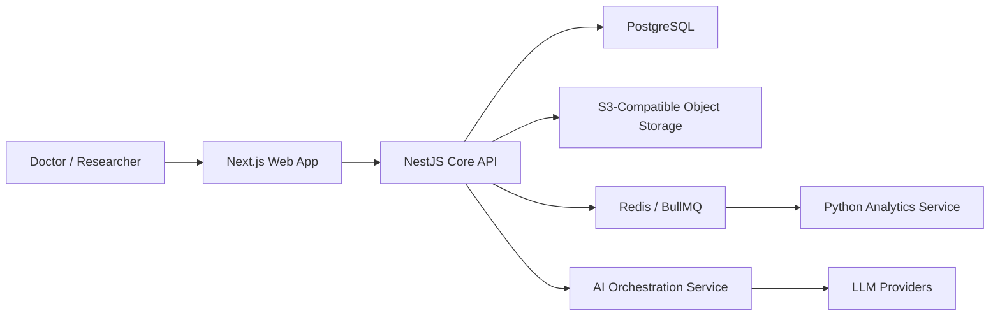
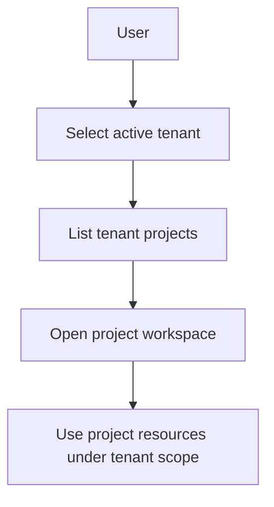
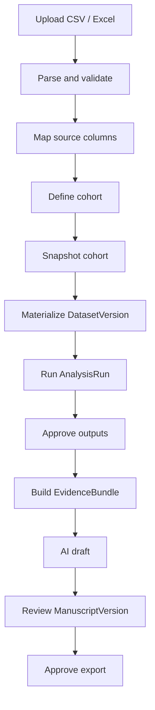
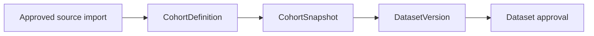
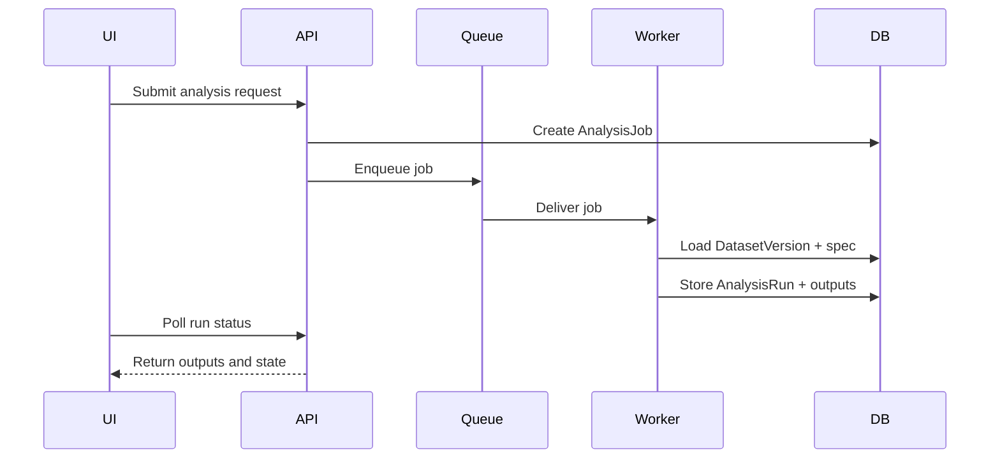
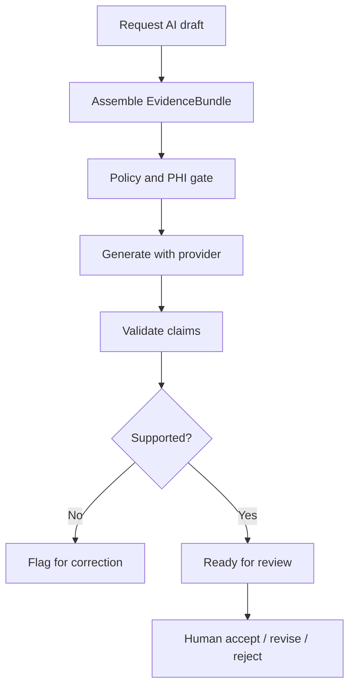
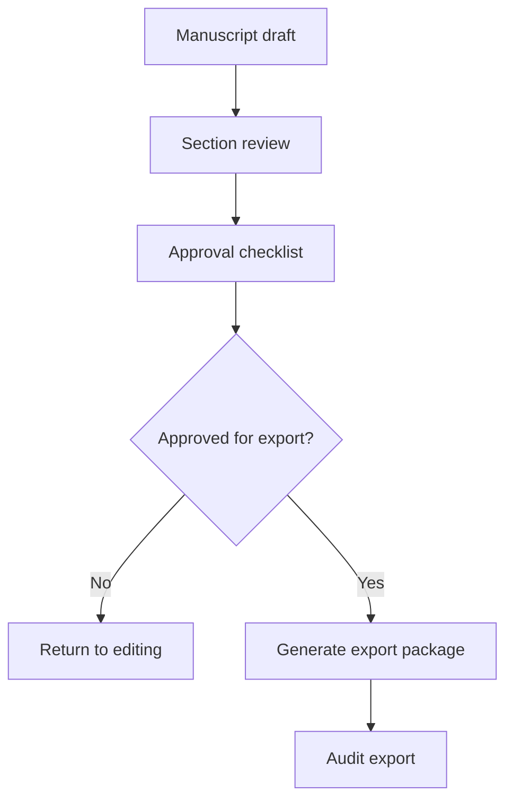

# System Workflows

## System Context

## Tenant and Project Interaction

## Data Lifecycle

## Cohort to Dataset Flow

## Analytics Job Flow

## AI Draft Review Flow

## Manuscript Approval and Export Flow

