# AIORTA Platform Functional Workflows

## Purpose
This document is the consolidated functional reference for the AIORTA platform. It explains what the platform does, who uses it, how the major modules interact, and how the end-to-end research workflow moves from project setup to governed AI-assisted manuscript output.

It complements, but does not replace, the lower-level architecture references in:
- [`/Users/sajithchandran/aira/aiorta/docs/architecture/technical-blueprint.md`](/Users/sajithchandran/aira/aiorta/docs/architecture/technical-blueprint.md)
- [`/Users/sajithchandran/aira/aiorta/docs/architecture/domain-model.md`](/Users/sajithchandran/aira/aiorta/docs/architecture/domain-model.md)
- [`/Users/sajithchandran/aira/aiorta/docs/diagrams/system-workflows.md`](/Users/sajithchandran/aira/aiorta/docs/diagrams/system-workflows.md)
- [`/Users/sajithchandran/aira/aiorta/docs/product/modules-and-features.md`](/Users/sajithchandran/aira/aiorta/docs/product/modules-and-features.md)

## Platform Summary
AIORTA is a multi-tenant AI clinical research platform for doctors, clinical researchers, statisticians, and hospital research teams. It turns governed clinical data into reproducible analysis outputs and evidence-grounded manuscript drafts.

The platform is built around these operating principles:
- every major business object is tenant-aware
- project is the primary research workspace
- dataset versions are immutable
- analytics runs are reproducible and traceable
- AI output must be grounded in approved research evidence
- auditability is required for sensitive data access and governed actions

## Primary Users

### Doctor investigator
Goals:
- create or join a research workspace
- define a project around a study question
- review cohorts, outputs, and manuscript drafts

Typical actions:
- create project
- review protocol and governance state
- approve outputs and manuscript changes

### Clinical researcher
Goals:
- define study assets and research workflows
- coordinate datasets, cohorts, documents, and drafts

Typical actions:
- manage project artifacts
- create cohort definitions
- create manuscript versions and update sections

### Statistician
Goals:
- create statistical plans
- run reproducible analyses
- validate result tables and figures

Typical actions:
- create statistical plan
- launch analysis run
- inspect result summaries

### Hospital or team administrator
Goals:
- manage members and roles
- control tenant access boundaries
- review access and audit activity

Typical actions:
- assign tenant roles
- review access logs
- manage governance readiness

## Functional Scope
The current AIORTA scope covers:
- authentication and session entry
- tenant selection and membership-based access
- project workspaces
- protocols and study documents
- cohorts and cohort rules
- datasets and immutable dataset versions
- analytics plans and runs
- manuscripts and manuscript versions
- AI jobs, outputs, and human review
- approvals, signatures, and IRB submissions
- audit logs and access logs

## Functional Module Map

| Module | Main Purpose | Core User Value |
| --- | --- | --- |
| Auth | authenticate users and issue JWT access | secure entry into the tenant workspace |
| Tenants | isolate data and memberships | safe collaboration across teams and organizations |
| Projects | organize research work | one working area per study or program |
| Protocols | manage protocol versions | controlled study documentation |
| Documents | store study-supporting artifacts | governed research files and attachments |
| Cohorts | define inclusion and exclusion logic | reproducible population selection |
| Datasets | register datasets and immutable versions | analysis-ready and traceable data lineage |
| Analytics | plan and run statistical work | reproducible result generation |
| Manuscripts | manage drafts and sections | publication workflow under version control |
| AI | generate grounded drafts and review decisions | faster writing with evidence traceability |
| Governance | approvals, signatures, IRB records | controlled release and regulatory readiness |
| Audit | record actions and access events | healthcare-grade accountability |

## High-Level User Journey
```mermaid
flowchart LR
  A["User signs in"] --> B["Select or resolve tenant"]
  B --> C["Open project workspace"]
  C --> D["Define protocol and supporting documents"]
  D --> E["Build cohort"]
  E --> F["Materialize dataset version"]
  F --> G["Run analysis"]
  G --> H["Review tables and figures"]
  H --> I["Create manuscript version"]
  I --> J["Request AI assistance"]
  J --> K["Review AI output"]
  K --> L["Approve manuscript and governance artifacts"]
```

## End-to-End Platform Workflow

### 1. Authentication and tenant resolution
The user signs in with email and password. The platform resolves the user identity, validates membership, and enters a tenant-scoped workspace.

Functional behavior:
- user submits credentials
- backend validates password hash
- JWT is issued
- frontend stores the access token in an HTTP-only cookie
- tenant list is resolved
- user enters a tenant-specific workspace

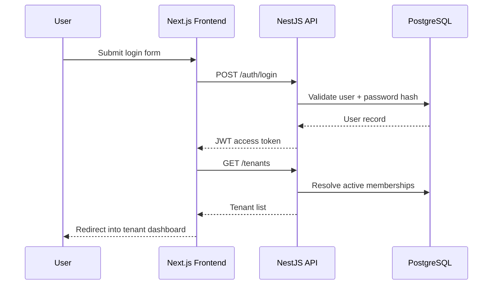

### 2. Project workspace setup
Each research effort belongs to a project inside a tenant. The project becomes the anchor for protocols, cohorts, datasets, analyses, manuscripts, governance records, and audit scope.

Functional behavior:
- create project
- optionally attach study code and description
- assign collaborators
- begin protocol, cohort, dataset, and analysis work

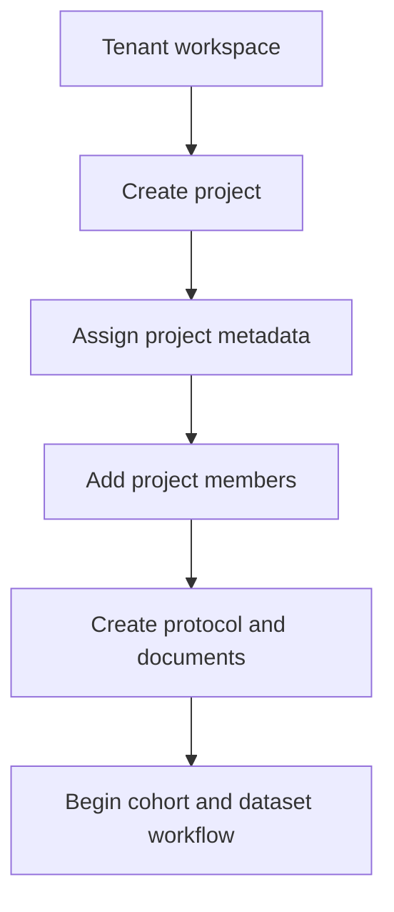

### 3. Protocol and study documentation
The protocol module stores versioned protocol records. The study document module stores supporting artifacts such as IRB letters, SAP files, templates, and attachments.

Functional behavior:
- create protocol version
- list protocol versions for a project
- update protocol metadata and status
- create and list study documents

Primary outcome:
- the project has a documented study basis before downstream dataset and manuscript work expands

### 4. Cohort definition workflow
The cohort module defines the target population using nested AND/OR logic. This is one of the most important product workflows because it connects clinical definitions to downstream reproducible data extraction.

Functional behavior:
- create cohort record
- add nested cohort rules
- preview cohort metadata
- inspect rule count and subject count

Key behavior:
- rules support nested boolean groups
- preview should reflect the current criteria state
- cohort output can become input for dataset materialization

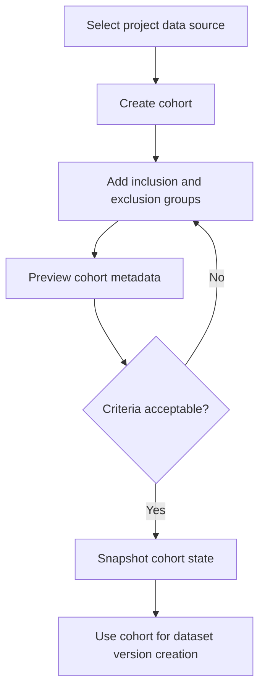

### 5. Dataset and lineage workflow
Datasets are logical research datasets. Dataset versions are immutable physical versions used for reproducible analysis.

Functional behavior:
- create dataset definition
- create dataset version
- list dataset versions
- inspect lineage summary

Required platform behavior:
- each dataset version is immutable once created
- lineage is inspectable
- downstream analytics and AI references point to specific dataset versions

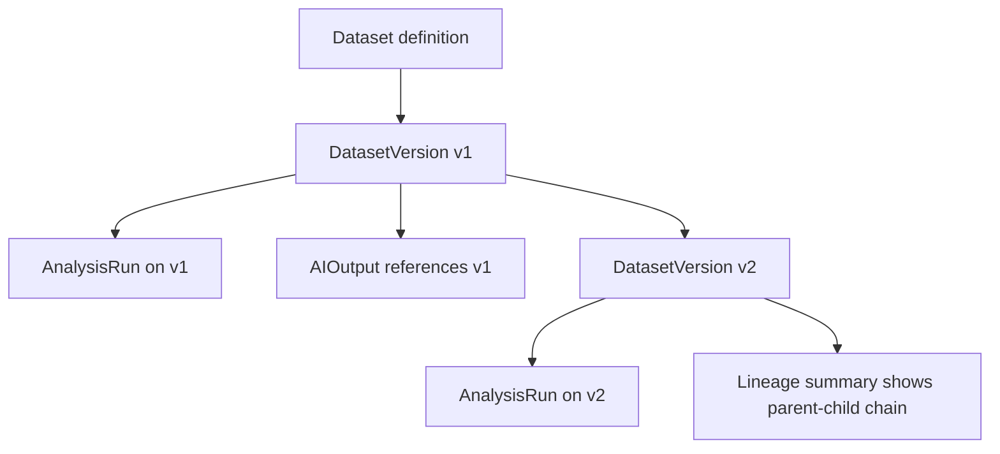

### 6. Analytics workflow
Analytics work starts with a statistical plan and produces reproducible run records and artifacts.

Functional behavior:
- create statistical plan
- start analysis run
- inspect analysis status
- read result table and figure summaries

Required platform behavior:
- analysis run is tied to a specific dataset version
- analysis records preserve runtime metadata
- outputs remain project- and tenant-scoped

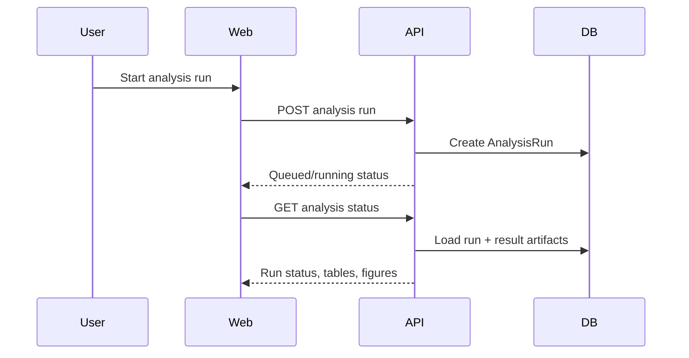

### 7. Manuscript workflow
The manuscript module provides sectioned writing under version control. It is designed for long-running scientific writing rather than ad hoc note taking.

Functional behavior:
- create manuscript
- create manuscript version
- list manuscript versions
- update manuscript sections

Required platform behavior:
- manuscript versions are distinct records
- sections support IMRaD structure
- writing is linked to approved outputs and traceable sources

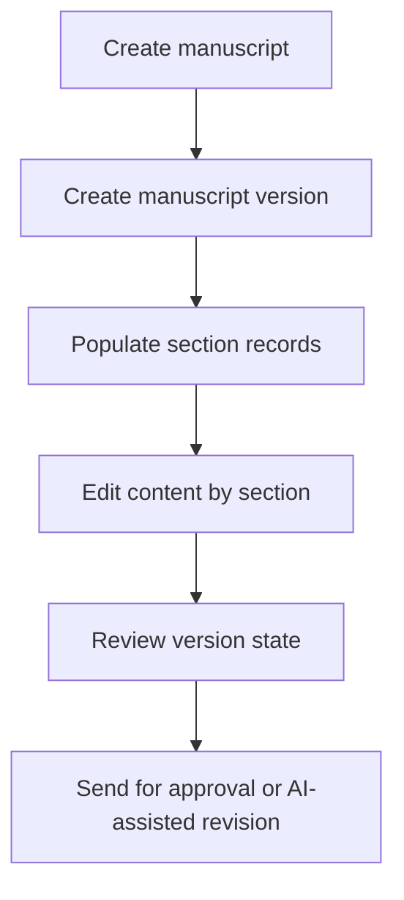

### 8. AI-assisted drafting workflow
AI is not allowed to generate arbitrary research claims. It must be grounded in dataset, analysis, and manuscript lineage.

Functional behavior:
- create AI job
- retrieve AI output
- review AI output
- approve or reject AI output

Required platform behavior:
- each AI output references dataset version, analysis run, and manuscript section
- AI outputs remain reviewable and non-destructive
- human review is explicit before approval

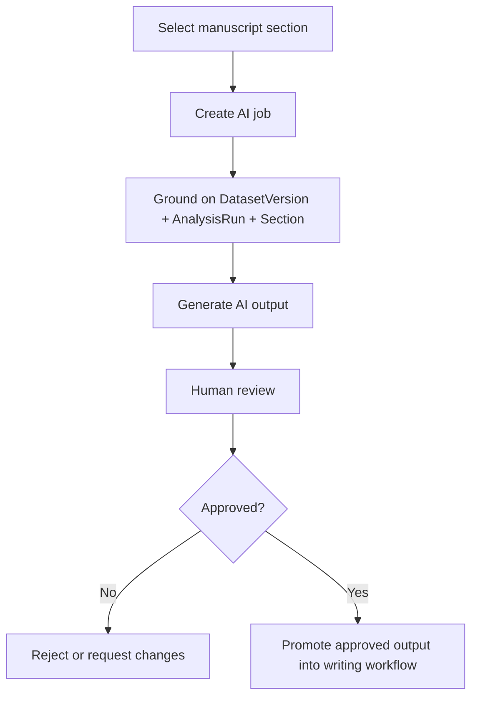

### 9. Governance workflow
Governance overlays the core research lifecycle. It does not replace the domain workflows; it constrains and records controlled approvals.

Functional behavior:
- create approval record
- create or update signature
- create or update IRB submission
- list current governance state by project

Typical approval targets:
- protocol
- dataset version
- analysis run or analysis result
- AI output
- manuscript version
- IRB submission

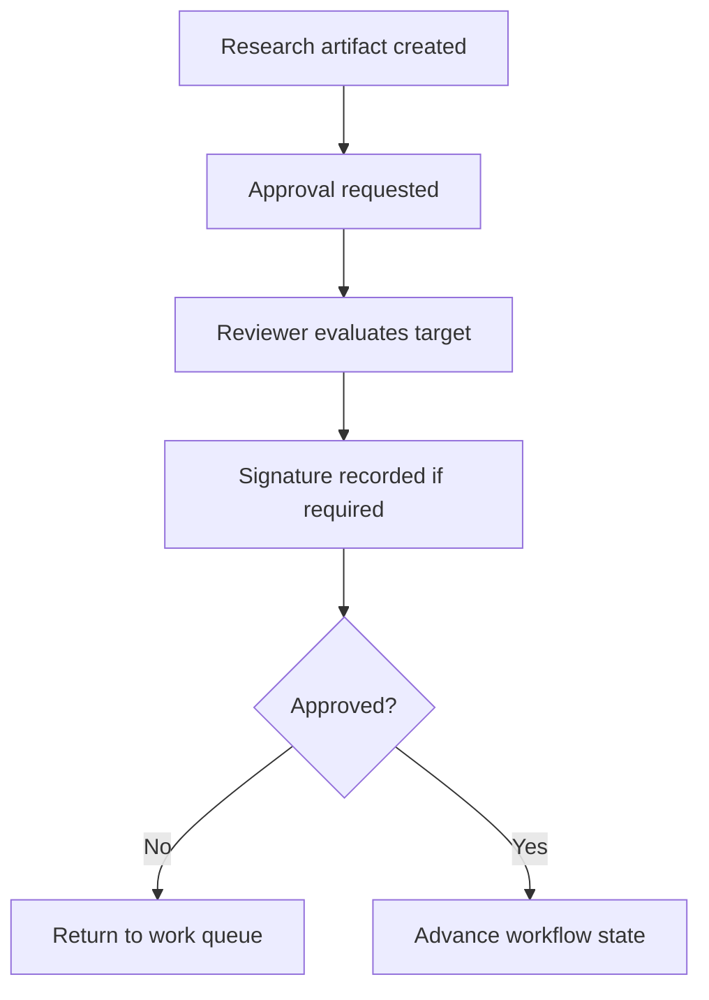

### 10. Audit and access accountability workflow
Audit is cross-cutting. Sensitive create, update, delete, and access events must be attributable to actor, tenant, project, resource, and time.

Functional behavior:
- capture audit log for governed actions
- capture access log for reads/downloads/exports
- expose project-level audit and tenant-level access views

Required platform behavior:
- logs remain queryable by tenant and project
- logs support incident review and governance review
- access events are distinct from business mutation events

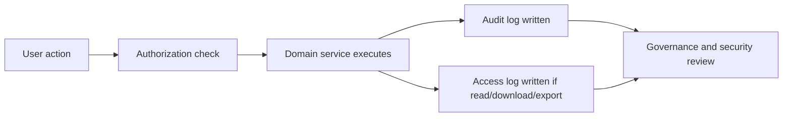

## Module-to-Module Dependency Chain
The dominant research dependency chain is:

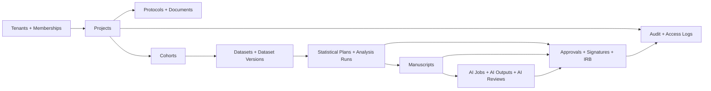

## Frontend Functional Surfaces
The current frontend design is built around these primary user surfaces:
- dashboard
- projects list
- project overview
- protocol view
- cohort builder
- dataset workspace
- analytics workspace
- manuscript editor
- governance view
- admin and member management

Expected frontend behavior:
- all tenant workspace data loads from backend APIs
- no browser-side mock data should be required for core pages
- tenant routes require authenticated session context
- sign-in and sign-out are explicit

## Backend Functional Surfaces
The current backend functional foundation includes:
- JWT authentication
- tenant-aware request context
- tenant membership and permission checks
- Prisma-based tenant-safe reads and writes
- audit/access log surfaces
- CRUD foundations for projects, cohorts, datasets, analytics metadata, manuscripts, governance, protocols, documents, and users

## Key Functional Rules

### Tenant safety
- users only access data within an allowed tenant context
- all major entities are tenant-aware
- project-level work remains inside a tenant boundary

### Reproducibility
- dataset version is immutable
- analysis run is tied to dataset version
- AI output references exact upstream evidence anchors

### Governance
- approvals are explicit records
- signatures are tracked records
- IRB state is not implied; it is stored and queryable

### AI safety
- AI cannot be treated as source truth
- AI output must be reviewable
- final manuscript export depends on governed state

## Current Functional Status
At the current implementation stage, the platform has:
- backend CRUD and read surfaces across the main basic entities
- frontend authenticated session flow
- tenant-scoped app shell
- backend-connected project, cohort, dataset, analysis, manuscript, governance, and admin pages
- local development support for PostgreSQL and PgAdmin

Still intentionally deferred at workflow depth:
- true analytics execution worker behavior
- true AI provider execution and grounding implementation
- file upload transport for study documents
- invitation email workflows
- richer export workflows

## Recommended Reading Order
For new engineers or product stakeholders:

1. read this document for platform behavior
2. read [`/Users/sajithchandran/aira/aiorta/docs/architecture/technical-blueprint.md`](/Users/sajithchandran/aira/aiorta/docs/architecture/technical-blueprint.md) for system structure
3. read [`/Users/sajithchandran/aira/aiorta/docs/architecture/domain-model.md`](/Users/sajithchandran/aira/aiorta/docs/architecture/domain-model.md) for aggregate ownership
4. read [`/Users/sajithchandran/aira/aiorta/docs/backend/backend-architecture.md`](/Users/sajithchandran/aira/aiorta/docs/backend/backend-architecture.md) for backend module structure
5. read [`/Users/sajithchandran/aira/aiorta/docs/frontend/frontend-architecture.md`](/Users/sajithchandran/aira/aiorta/docs/frontend/frontend-architecture.md) for frontend module structure
